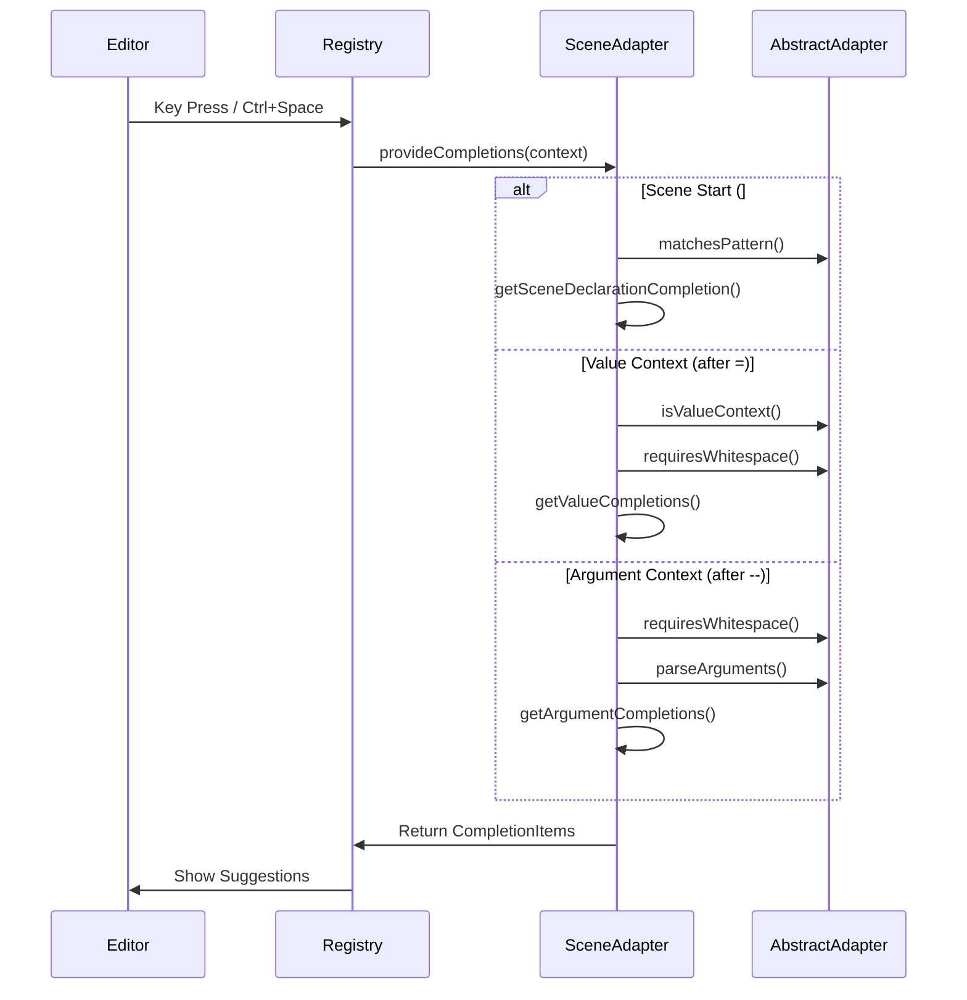

# Monaco Editor Plugin System: Completion Flow

## Classes & Methods Overview

### AbstractAdapter (Base)
```typescript
abstract class AbstractAdapter {
  matchesPattern(lineContent: string): boolean
  requiresWhitespace(lineContent: string, position: Position): boolean
  isValueContext(lineContent: string, position: Position): boolean
  parseArguments(line: string): Set<string>
  createCompletionDoc(sections: string[]): { value: string, isTrusted: boolean }
}
```

### SceneAdapter (Plugin)
```typescript
class SceneAdapter extends AbstractAdapter {
  getSceneDeclarationCompletion(context: CommandContext)
  getValueCompletions(context: CommandContext)
  getArgumentCompletions(context: CommandContext)
}
```

## Completion Flow



## Context Examples

### Scene Declaration
```
Input: ## 
Pattern: /^##\s*$/
Method: getSceneDeclarationCompletion()
Output: !!scene --title=scene-1 --duration=5
```

### Argument Completion
```
Input: ## !!scene --
Pattern: /\s--\w*$/
Method: getArgumentCompletions()
Output: title, duration, background
```

### Value Completion
```
Input: ## !!scene --background=
Pattern: /--(\w+)=\s*$/
Method: getValueCompletions()
Output: transparent, black, white, etc.
```

## Configuration Flow
1. Plugin registers with config:
```typescript
{
  name: "scene",
  pattern: {
    type: "scene",
    prefix: "!!",
    leadingSymbols: ["##"]
  },
  arguments: {
    title: { type: "string" },
    duration: { type: "number" },
    background: { type: "string" }
  }
}
```

2. Base adapter uses config to:
   - Match command patterns
   - Validate argument structure
   - Check spacing requirements
   - Generate documentation

3. Plugin adapter uses config to:
   - Provide specific completions
   - Format suggestions
   - Handle values